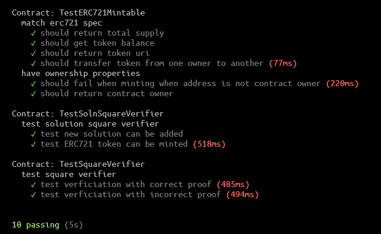
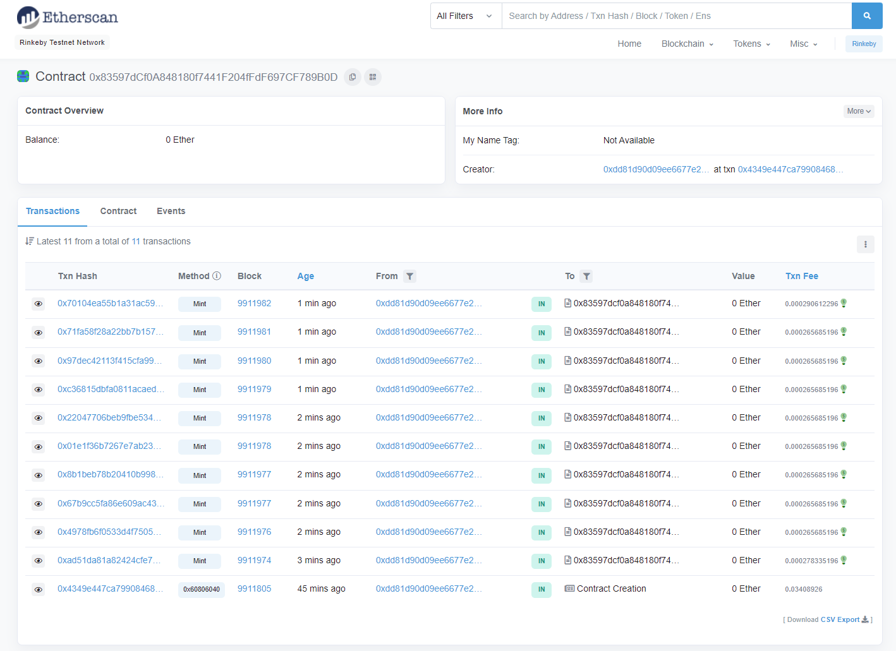
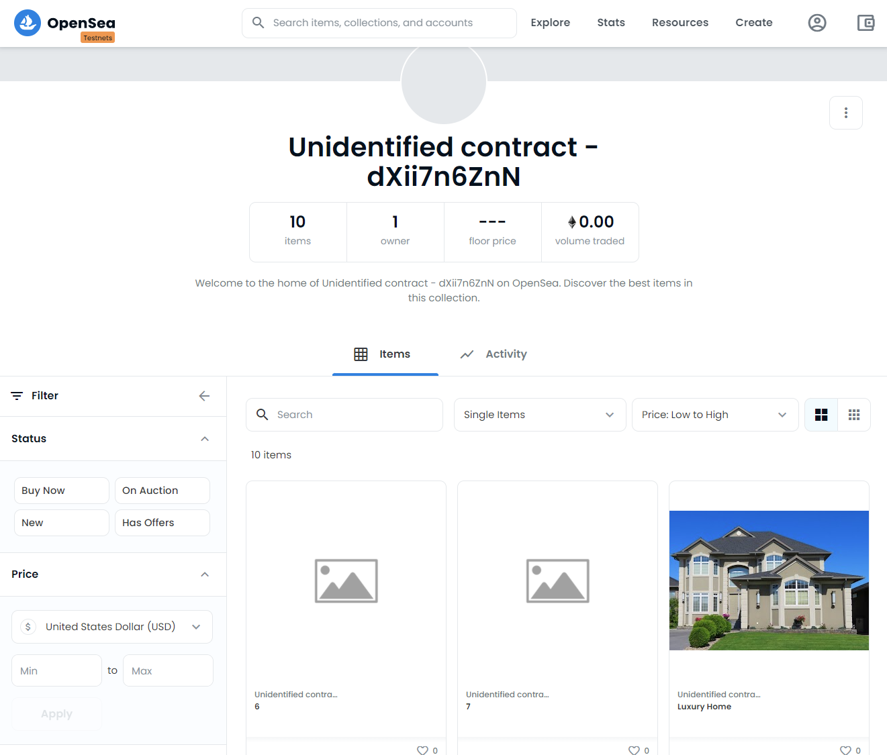
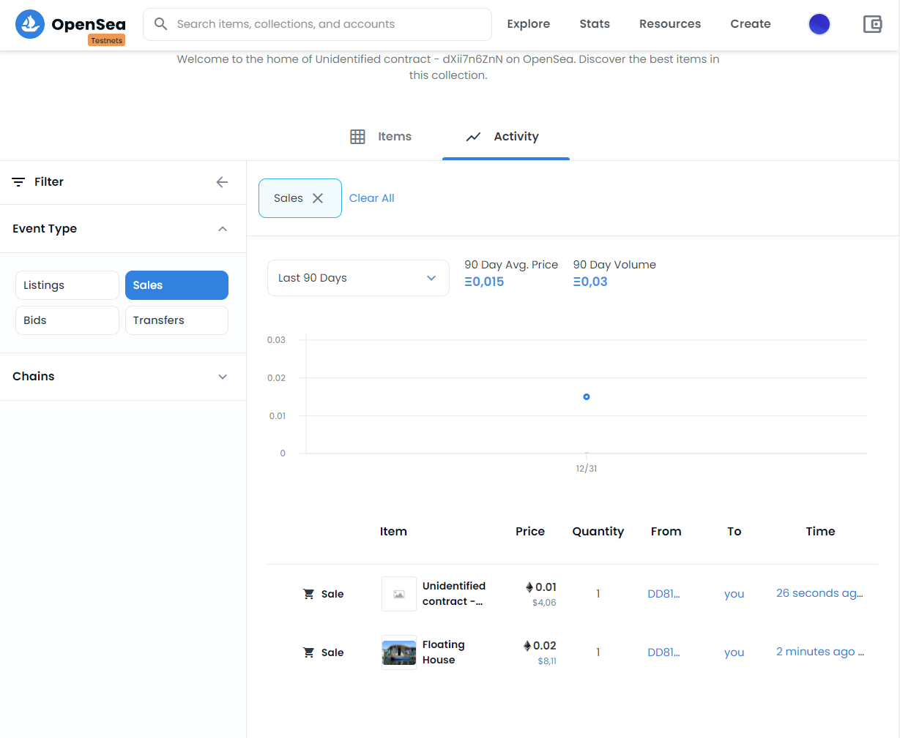

# Udacity Blockchain Capstone

The capstone will build upon the knowledge you have gained in the course in order to build a decentralized housing product. 

## Versions

- Truffle Version: v.5.2.0
- Ganache CLI: v6.12.2
- Node: v14.16.0
- Solidity solc v0.5.17
- ZoKrates Docker Image: zokrates/zokrates:0.4.6

## Instructions for Local Testing

```bash
# local test
# start ganache
ganache-cli -l 9999999 -m "candy maple cake sugar pudding cream honey rich smooth crumble sweet treat" --accounts=10

# execute truffle tests
cd eth-contracts
truffle test

# or individually
truffle test ./test/TestERC721Mintable.js
truffle test ./test/TestSquareVerifier.js
truffle test ./test/TestSolnSquareVerifier.js

```

### Test Results



## Deployment


```bash
# set infuraKey + mnemonic in truffle-config.js

# deploy to  rinkeby testnet
truffle deploy --network rinkeby
```

### Contract Details

- Contract Addresses: 
    - `Verifier` at [0xa5a324F614e0B2925958B4285dEA1E63aC86282e](https://rinkeby.etherscan.io/address/0xa5a324F614e0B2925958B4285dEA1E63aC86282e)
    - `SolnSquareVerifier` at [0x83597dCf0A848180f7441F204fFdF697CF789B0D](https://rinkeby.etherscan.io/address/0x83597dCf0A848180f7441F204fFdF697CF789B0D)
- Contract Abi's
    - `SolnSquareVerifier` ABI
    ```json
    [
    {
        "inputs": [
        {
            "internalType": "address",
            "name": "caller",
            "type": "address"
        },
        {
            "internalType": "string",
            "name": "name",
            "type": "string"
        },
        {
            "internalType": "string",
            "name": "symbol",
            "type": "string"
        }
        ],
        "payable": false,
        "stateMutability": "nonpayable",
        "type": "constructor"
    },
    {
        "anonymous": false,
        "inputs": [
        {
            "indexed": false,
            "internalType": "uint256",
            "name": "Index",
            "type": "uint256"
        },
        {
            "indexed": false,
            "internalType": "address",
            "name": "Address",
            "type": "address"
        }
        ],
        "name": "AddedSolution",
        "type": "event"
    },
    {
        "anonymous": false,
        "inputs": [
        {
            "indexed": true,
            "internalType": "address",
            "name": "owner",
            "type": "address"
        },
        {
            "indexed": true,
            "internalType": "address",
            "name": "approved",
            "type": "address"
        },
        {
            "indexed": true,
            "internalType": "uint256",
            "name": "tokenId",
            "type": "uint256"
        }
        ],
        "name": "Approval",
        "type": "event"
    },
    {
        "anonymous": false,
        "inputs": [
        {
            "indexed": true,
            "internalType": "address",
            "name": "owner",
            "type": "address"
        },
        {
            "indexed": true,
            "internalType": "address",
            "name": "operator",
            "type": "address"
        },
        {
            "indexed": false,
            "internalType": "bool",
            "name": "approved",
            "type": "bool"
        }
        ],
        "name": "ApprovalForAll",
        "type": "event"
    },
    {
        "anonymous": false,
        "inputs": [
        {
            "indexed": false,
            "internalType": "address",
            "name": "oldOwner",
            "type": "address"
        },
        {
            "indexed": false,
            "internalType": "address",
            "name": "newOwner",
            "type": "address"
        }
        ],
        "name": "OwnerShipTransfer",
        "type": "event"
    },
    {
        "anonymous": false,
        "inputs": [
        {
            "indexed": false,
            "internalType": "address",
            "name": "triggerAccount",
            "type": "address"
        }
        ],
        "name": "Paused",
        "type": "event"
    },
    {
        "anonymous": false,
        "inputs": [
        {
            "indexed": true,
            "internalType": "address",
            "name": "from",
            "type": "address"
        },
        {
            "indexed": true,
            "internalType": "address",
            "name": "to",
            "type": "address"
        },
        {
            "indexed": true,
            "internalType": "uint256",
            "name": "tokenId",
            "type": "uint256"
        }
        ],
        "name": "Transfer",
        "type": "event"
    },
    {
        "anonymous": false,
        "inputs": [
        {
            "indexed": false,
            "internalType": "address",
            "name": "triggerAccount",
            "type": "address"
        }
        ],
        "name": "Unpaused",
        "type": "event"
    },
    {
        "constant": false,
        "inputs": [
        {
            "internalType": "bytes32",
            "name": "_myid",
            "type": "bytes32"
        },
        {
            "internalType": "string",
            "name": "_result",
            "type": "string"
        }
        ],
        "name": "__callback",
        "outputs": [],
        "payable": false,
        "stateMutability": "nonpayable",
        "type": "function"
    },
    {
        "constant": false,
        "inputs": [
        {
            "internalType": "bytes32",
            "name": "_myid",
            "type": "bytes32"
        },
        {
            "internalType": "string",
            "name": "_result",
            "type": "string"
        },
        {
            "internalType": "bytes",
            "name": "_proof",
            "type": "bytes"
        }
        ],
        "name": "__callback",
        "outputs": [],
        "payable": false,
        "stateMutability": "nonpayable",
        "type": "function"
    },
    {
        "constant": false,
        "inputs": [
        {
            "internalType": "address",
            "name": "to",
            "type": "address"
        },
        {
            "internalType": "uint256",
            "name": "tokenId",
            "type": "uint256"
        }
        ],
        "name": "approve",
        "outputs": [],
        "payable": false,
        "stateMutability": "nonpayable",
        "type": "function"
    },
    {
        "constant": true,
        "inputs": [
        {
            "internalType": "address",
            "name": "owner",
            "type": "address"
        }
        ],
        "name": "balanceOf",
        "outputs": [
        {
            "internalType": "uint256",
            "name": "",
            "type": "uint256"
        }
        ],
        "payable": false,
        "stateMutability": "view",
        "type": "function"
    },
    {
        "constant": true,
        "inputs": [
        {
            "internalType": "uint256",
            "name": "tokenId",
            "type": "uint256"
        }
        ],
        "name": "getApproved",
        "outputs": [
        {
            "internalType": "address",
            "name": "",
            "type": "address"
        }
        ],
        "payable": false,
        "stateMutability": "view",
        "type": "function"
    },
    {
        "constant": true,
        "inputs": [],
        "name": "getBaseTokenURI",
        "outputs": [
        {
            "internalType": "string",
            "name": "",
            "type": "string"
        }
        ],
        "payable": false,
        "stateMutability": "view",
        "type": "function"
    },
    {
        "constant": true,
        "inputs": [],
        "name": "getName",
        "outputs": [
        {
            "internalType": "string",
            "name": "",
            "type": "string"
        }
        ],
        "payable": false,
        "stateMutability": "view",
        "type": "function"
    },
    {
        "constant": true,
        "inputs": [],
        "name": "getOwner",
        "outputs": [
        {
            "internalType": "address",
            "name": "",
            "type": "address"
        }
        ],
        "payable": false,
        "stateMutability": "view",
        "type": "function"
    },
    {
        "constant": true,
        "inputs": [],
        "name": "getSymbol",
        "outputs": [
        {
            "internalType": "string",
            "name": "",
            "type": "string"
        }
        ],
        "payable": false,
        "stateMutability": "view",
        "type": "function"
    },
    {
        "constant": true,
        "inputs": [
        {
            "internalType": "address",
            "name": "owner",
            "type": "address"
        },
        {
            "internalType": "address",
            "name": "operator",
            "type": "address"
        }
        ],
        "name": "isApprovedForAll",
        "outputs": [
        {
            "internalType": "bool",
            "name": "",
            "type": "bool"
        }
        ],
        "payable": false,
        "stateMutability": "view",
        "type": "function"
    },
    {
        "constant": false,
        "inputs": [
        {
            "internalType": "address",
            "name": "to",
            "type": "address"
        },
        {
            "internalType": "uint256",
            "name": "tokenId",
            "type": "uint256"
        }
        ],
        "name": "mint",
        "outputs": [
        {
            "internalType": "bool",
            "name": "",
            "type": "bool"
        }
        ],
        "payable": false,
        "stateMutability": "nonpayable",
        "type": "function"
    },
    {
        "constant": true,
        "inputs": [
        {
            "internalType": "uint256",
            "name": "tokenId",
            "type": "uint256"
        }
        ],
        "name": "ownerOf",
        "outputs": [
        {
            "internalType": "address",
            "name": "",
            "type": "address"
        }
        ],
        "payable": false,
        "stateMutability": "view",
        "type": "function"
    },
    {
        "constant": false,
        "inputs": [
        {
            "internalType": "address",
            "name": "from",
            "type": "address"
        },
        {
            "internalType": "address",
            "name": "to",
            "type": "address"
        },
        {
            "internalType": "uint256",
            "name": "tokenId",
            "type": "uint256"
        }
        ],
        "name": "safeTransferFrom",
        "outputs": [],
        "payable": false,
        "stateMutability": "nonpayable",
        "type": "function"
    },
    {
        "constant": false,
        "inputs": [
        {
            "internalType": "address",
            "name": "from",
            "type": "address"
        },
        {
            "internalType": "address",
            "name": "to",
            "type": "address"
        },
        {
            "internalType": "uint256",
            "name": "tokenId",
            "type": "uint256"
        },
        {
            "internalType": "bytes",
            "name": "_data",
            "type": "bytes"
        }
        ],
        "name": "safeTransferFrom",
        "outputs": [],
        "payable": false,
        "stateMutability": "nonpayable",
        "type": "function"
    },
    {
        "constant": false,
        "inputs": [
        {
            "internalType": "address",
            "name": "to",
            "type": "address"
        },
        {
            "internalType": "bool",
            "name": "approved",
            "type": "bool"
        }
        ],
        "name": "setApprovalForAll",
        "outputs": [],
        "payable": false,
        "stateMutability": "nonpayable",
        "type": "function"
    },
    {
        "constant": false,
        "inputs": [
        {
            "internalType": "bool",
            "name": "active",
            "type": "bool"
        }
        ],
        "name": "setPause",
        "outputs": [],
        "payable": false,
        "stateMutability": "nonpayable",
        "type": "function"
    },
    {
        "constant": true,
        "inputs": [
        {
            "internalType": "bytes4",
            "name": "interfaceId",
            "type": "bytes4"
        }
        ],
        "name": "supportsInterface",
        "outputs": [
        {
            "internalType": "bool",
            "name": "",
            "type": "bool"
        }
        ],
        "payable": false,
        "stateMutability": "view",
        "type": "function"
    },
    {
        "constant": true,
        "inputs": [
        {
            "internalType": "uint256",
            "name": "index",
            "type": "uint256"
        }
        ],
        "name": "tokenByIndex",
        "outputs": [
        {
            "internalType": "uint256",
            "name": "",
            "type": "uint256"
        }
        ],
        "payable": false,
        "stateMutability": "view",
        "type": "function"
    },
    {
        "constant": true,
        "inputs": [
        {
            "internalType": "address",
            "name": "owner",
            "type": "address"
        },
        {
            "internalType": "uint256",
            "name": "index",
            "type": "uint256"
        }
        ],
        "name": "tokenOfOwnerByIndex",
        "outputs": [
        {
            "internalType": "uint256",
            "name": "",
            "type": "uint256"
        }
        ],
        "payable": false,
        "stateMutability": "view",
        "type": "function"
    },
    {
        "constant": true,
        "inputs": [
        {
            "internalType": "uint256",
            "name": "tokenId",
            "type": "uint256"
        }
        ],
        "name": "tokenURI",
        "outputs": [
        {
            "internalType": "string",
            "name": "",
            "type": "string"
        }
        ],
        "payable": false,
        "stateMutability": "view",
        "type": "function"
    },
    {
        "constant": true,
        "inputs": [],
        "name": "totalSupply",
        "outputs": [
        {
            "internalType": "uint256",
            "name": "",
            "type": "uint256"
        }
        ],
        "payable": false,
        "stateMutability": "view",
        "type": "function"
    },
    {
        "constant": false,
        "inputs": [
        {
            "internalType": "address",
            "name": "from",
            "type": "address"
        },
        {
            "internalType": "address",
            "name": "to",
            "type": "address"
        },
        {
            "internalType": "uint256",
            "name": "tokenId",
            "type": "uint256"
        }
        ],
        "name": "transferFrom",
        "outputs": [],
        "payable": false,
        "stateMutability": "nonpayable",
        "type": "function"
    },
    {
        "constant": false,
        "inputs": [
        {
            "internalType": "address",
            "name": "newOwner",
            "type": "address"
        }
        ],
        "name": "transferOwnership",
        "outputs": [],
        "payable": false,
        "stateMutability": "nonpayable",
        "type": "function"
    },
    {
        "constant": false,
        "inputs": [
        {
            "internalType": "uint256[2]",
            "name": "a",
            "type": "uint256[2]"
        },
        {
            "internalType": "uint256[2][2]",
            "name": "b",
            "type": "uint256[2][2]"
        },
        {
            "internalType": "uint256[2]",
            "name": "c",
            "type": "uint256[2]"
        },
        {
            "internalType": "uint256[2]",
            "name": "input",
            "type": "uint256[2]"
        },
        {
            "internalType": "uint256",
            "name": "Index",
            "type": "uint256"
        }
        ],
        "name": "addSolution",
        "outputs": [],
        "payable": false,
        "stateMutability": "nonpayable",
        "type": "function"
    },
    {
        "constant": false,
        "inputs": [
        {
            "internalType": "uint256[2]",
            "name": "a",
            "type": "uint256[2]"
        },
        {
            "internalType": "uint256[2][2]",
            "name": "b",
            "type": "uint256[2][2]"
        },
        {
            "internalType": "uint256[2]",
            "name": "c",
            "type": "uint256[2]"
        },
        {
            "internalType": "uint256[2]",
            "name": "input",
            "type": "uint256[2]"
        },
        {
            "internalType": "uint256",
            "name": "tokenId",
            "type": "uint256"
        }
        ],
        "name": "mintNewNFT",
        "outputs": [],
        "payable": false,
        "stateMutability": "nonpayable",
        "type": "function"
    }
    ]
  ```
- OpenSea MarketPlace Storefront link: 


### Minted Tokens

Minted tokens can be seen on the contract e.g. on etherscan [0x83597dCf0A848180f7441F204fFdF697CF789B0D](https://rinkeby.etherscan.io/address/0x83597dCf0A848180f7441F204fFdF697CF789B0D):



#### OpenSea

OpenSea MarketPlace Storefront link: 



The token owner can then put those houses / tokens for sale and other users / wallets are capable of buying them. See activity to show sales that happened.




## Project Resources

* [Remix - Solidity IDE](https://remix.ethereum.org/)
* [Visual Studio Code](https://code.visualstudio.com/)
* [Truffle Framework](https://truffleframework.com/)
* [Ganache - One Click Blockchain](https://truffleframework.com/ganache)
* [Open Zeppelin ](https://openzeppelin.org/)
* [Interactive zero knowledge 3-colorability demonstration](http://web.mit.edu/~ezyang/Public/graph/svg.html)
* [Docker](https://docs.docker.com/install/)
* [ZoKrates](https://github.com/Zokrates/ZoKrates)
